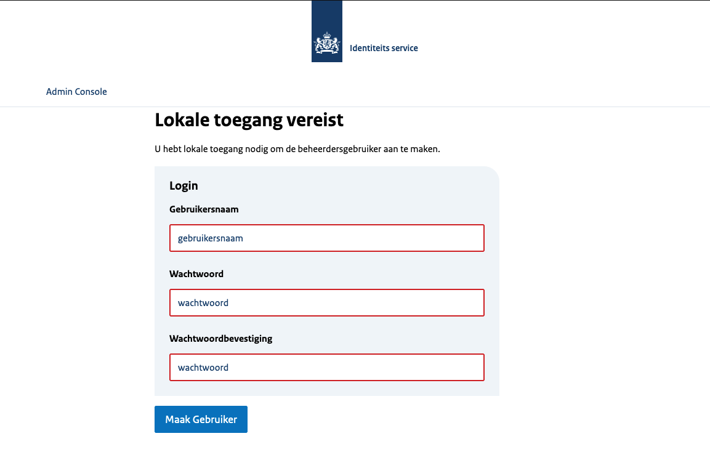

# Keycloak theme | NL Design System


Dit is een keycloak theme template gebaseerd op het [NL design system](https://nldesignsystem.nl/) met de [ROOS](https://nl-design-system.github.io/rvo/docs/) implementatie.

## Componenten

In keycloak zijn 5 componenten die overschreven kunnen worden:

* Account - Account Console
* Admin - Admin Console
* Email - Emails
* Login - Login formulieren
* Welcome - Welkom pagina

Zie de [keycloak documentatie](https://www.keycloak.org/docs/latest/server_development/#_themes) voor meer informatie

Verder heb je ook nog 'Common', dit zijn resources die gedeeld worden door all andere componenten

Je kan de componenten die gebruikt worden selecteren per realm via het admin paneel, behalve de welkom pagina, Die moet ingesteld worden als de server opstart met de '--spi-theme-welcome-theme=nl-design-system' optie.

## Bouwen

Om deze keycloak theme te bouwen kan men de volgende commandos uitvoeren. De commandos gaan er vanuit dat je [node](https://nodejs.org/en/download) en [java](https://www.azul.com/downloads/?package=jdk#zulu) geinstalleerd hebt.

```shell
npm install
npm run compile
npm run build
```

In de output/ folder is nu de keycloak-nl-design-system.jar beschikbaar.

Ook kan men de keycloak-nl-design-system.jar van de [github releases](../../releases) downloaden of [github action](../../actions/workflows/build.yaml) artifacts.

## Installeren

Om keycloak-nl-design-system.jar te implementeren in Keycloak, voegt u het toe aan de providers/ directory van Keycloak en start u de server opnieuw op als deze al actief is.

Zodra keycloak herstart is kan je inloggen als admin en de theme aanpassen naar nl-design-system. die de [keycloak documentatie](https://www.keycloak.org/docs/latest/server_development/#configuring-a-theme) voor meer informatie

## Omgevings variablen

In de templates kunnen omgevings variablen omgezet worden naar text. We gebruiken de volgende omgenvingsvariablen

| Variable | Beschrijving | default |
|---|---|---|
| ORGANIZATION | uw organizatie naam | Identiteits service |

## Screenshots

Om een indruk te geven van de template worden er wat screenshots beschikbaar gesteld

### Welkom pagina




### Login pagina


### Account pagina
