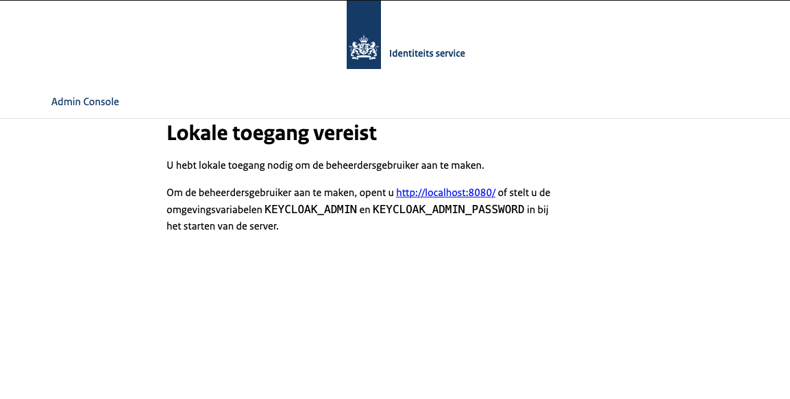

# Keycloak theme | NL Design System


Dit is een keycloak theme gebaseerd op het [NL design system](https://nldesignsystem.nl/) met de [ROOS](https://nl-design-system.github.io/rvo/docs/) implementatie.

## Componenten

In keycloak zijn 5 componenten die overschreven kunnen worden:

* Account - Account Console
* Admin - Admin Console
* Email - Emails
* Login - Login formulieren
* Welcome - Welkom pagina

Zie de [keycloak documentatie](https://www.keycloak.org/docs/latest/server_development/#_themes) voor meer informatie

Verder heb je ook nog 'Common', dit zijn resources die gedeeld worden door all andere componenten

Je kan de componenten die gebruikt worden selecteren per realm via het admin paneel, behalve de welkom pagina, Die moet ingesteld worden als de server opstart met de '--spi-theme-welcome-theme=nl-design-system' optie.

## Publiceren

Om deze keycloak theme te bouwen kan men de volgende commandos uitvoeren. De commandos gaan er vanuit dat je [node](https://nodejs.org/en/download) en [java](https://www.azul.com/downloads/?package=jdk#zulu) geinstalleerd hebt.

```shell
npm install
npm run compile
npm run build
```

In de output/ folder is nu de keycloak-nl-design-system.jar beschikbaar.

Ook kan men de keycloak-nl-design-system.jar van de [github releases](../../releases) downloaden of [github action](../../actions/workflows/build.yaml) artifacts.

## Installeren

Om keycloak-nl-design-system.jar te installeren in Keycloak, voegt u de keycloak-nl-design-system.jar van een gewenste [github release](../../releases) toe aan de /opt/keycloak/providers/ directory van Keycloak en start u de server opnieuw op als deze al actief is.

Zodra keycloak herstart is kan je inloggen als admin en de theme aanpassen naar nl-design-system. Zie de [keycloak documentatie](https://www.keycloak.org/docs/latest/server_development/#configuring-a-theme) voor meer informatie

Om keycloak-nl-design-system.jar aan een deployment van keycloak in kubernetes toe te voegen kan u het volgende doen

voeg een emptydir volume toe aan uw deployment
```yaml
      containers:
        - name: keycloak
          image: quay.io/keycloak/keycloak:25.0.1
          env:
            - name: ORGANIZATION
              value: "Ministerie van Binnenlandse Zaken en Koninkrijksrelaties"
          volumeMounts:
            - name: keycloak-provider
              mountPath: /opt/keycloak/providers/
      volumes:
        - name: keycloak-provider
          emptyDir: {}
```

voeg een init container toe (pas het versie v1.0.1 aan naar de gewenste versie)
```yaml
      initContainers:
        - name: keycloak-theme-downloader
          command:
            - wget 
            - https://github.com/MinBZK/keycloak-theme/releases/download/v1.0.1/keycloak-nl-design-system.jar
            - -O 
            - /opt/keycloak/providers/keycloak-nl-design-system.jar
          image: busybox:1.37.0
          securityContext:
            runAsUser: 0
          volumeMounts:
            - mountPath:  /opt/keycloak/providers/
              name: keycloak-provider
```

## Omgevings variablen

In de theme kunnen omgevings variable omgezet worden naar text. We gebruiken de volgende omgevingsvariabelen

| Variable | Beschrijving | default |
|---|---|---|
| ORGANIZATION | uw organisatie naam | Identiteits service |

## Screenshots

Om een indruk te geven van de theme worden er wat screenshots beschikbaar gesteld. Dit zijn impressies en kunnen iets afwijken naarmate we verder ontwikkelen.

### Welkom pagina





### Login pagina


### Account pagina

todo

## Styling aanpassen

Je kan zelf snel beginnen met het theme aanpassen

1. clone de repository met git
2. zorg dat je [docker](https://www.docker.com/products/docker-desktop/) geinstalleerd hebt
3. zorg dat je [node](https://nodejs.org/en) geinstalleerd hebt
4. run `npm install` om alle ROOS packages binnen te halen
5. run `npm run compile`om alle ROOS packages in common te krijgen.
6. ga in de gecloonde folder staan en doe een `docker compose up` commando
7. login op keycloak door naar localhost:8080 te gaan
8. login met username:admin wachtwoord:admin
9. ga naar `Realm settings`
10. ga naar `Themes`
11. pass het `Login theme` aan naar `nl-design-system`
12. log uit
13. nu zou je het theme moeten kunnen zien. als je iets aanpast in de thema/ folder zou de verandering direct zichtbaar moeten worden

als je voorbeeld theme files zoekt om te overschrijven kan je keycloak-themes zoeken of hier de jar file [downloaden](https://mvnrepository.com/artifact/org.keycloak/keycloak-themes/25.0.1). Je kan de jar uitpakken zoals een zip file. 
